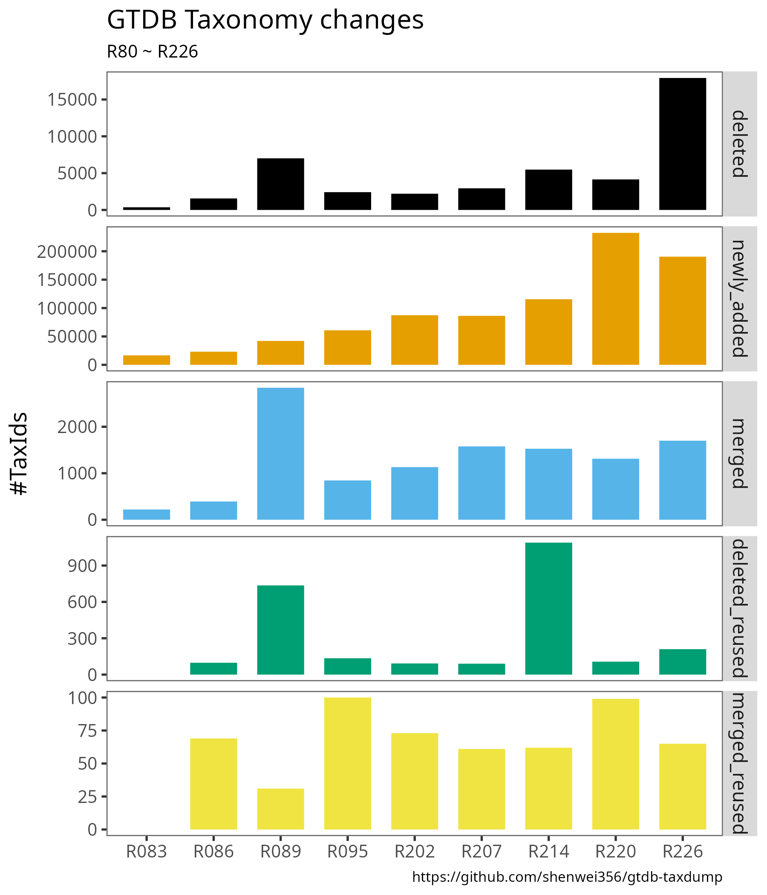

# GTDB taxonomy taxdump files with trackable TaxIds

Metagenomic tools like [Kraken2](https://github.com/DerrickWood/kraken2),
 [Centrifuge](https://github.com/DaehwanKimLab/centrifuge)
 and [KMCP](https://github.com/shenwei356/kmcp) support NCBI taxonomy in format of [NCBI taxdump files](https://ftp.ncbi.nlm.nih.gov/pub/taxonomy/).
[GTDB](https://gtdb.ecogenomic.org/), a prokaryotic genomes catalogue, has its own taxonomy data.
Though the genomes, derived from GenBank and RefSeq, can be mappped to NCBI taxonomy TaxIds,
there's an urgent need to create its own taxonomy taxdump files with ***stable and trackable*** TaxIds.

A [TaxonKit](https://github.com/shenwei356/taxonkit) command, [taxonkit create-taxdump](https://bioinf.shenwei.me/taxonkit/usage/#create-taxdump) is used
to create NCBI-style taxdump files for any taxonomy dataset,
including [GTDB](https://gtdb.ecogenomic.org/) and [ICTV](https://talk.ictvonline.org/).

Related projects:

- [ictv-taxdump](https://github.com/shenwei356/ictv-taxdump): NCBI-style taxdump files for International Committee on Taxonomy of Viruses (ICTV)
- [taxid-changelog](https://github.com/shenwei356/taxid-changelog): NCBI taxonomic identifier (taxid) changelog
- [taxonkit](https://github.com/shenwei356/taxonkit): A Practical and Efficient NCBI Taxonomy Toolkit

## Table of Contents

* [Method](#method)
    + [Taxonomic hierarchy](#taxonomic-hierarchy)
    + [Generation of TaxIds](#generation-of-taxids)
    + [Data and tools](#data-and-tools)
    + [Steps](#steps)
* [Download](#download)
* [Results](#results)
    + [Basic usage](#basic-usage)
    + [TaxId changes](#taxid-changes)
    + [Species changes](#species-changes)
    + [Summary](#summary)
    + [Taxon history of *Escherichia coli*](#taxon-history-of-escherichia-coli)
    + [Species of the genus *Escherichia*](#species-of-the-genus-escherichia)
    + [Common manipulations](#common-manipulations)
* [Known issues](#known-issues)
* [Merging GTDB and NCBI taxonomy](#merging-gtdb-and-ncbi-taxonomy)
* [Citation](#citation)
* [Contributing](#contributing)
* [License](#license)

## Method

### Taxonomic hierarchy

A GTDB species cluster contains >=1 assemblies, each can be treated as a strain.
So we can assign each assembly a TaxId with the rank of "no rank" below the species rank.
Therefore, we can also track the changes of these assemblies via the TaxId later.

### Generation of TaxIds

We just hash the rank+taxon_name (in lower case) of each taxon node to `uint64`
using [xxhash](https://github.com/cespare/xxhash/) and convert it to `int32`.

- For the NCBI assembly accession. 
  1) The prefix `GCA_` is not used because some GenBank entries (`GCA_000176655.2` in R80) were moved
  to RefSeq (`GCF_000176655.2` in R83) and the prefix changed. 
  2) The version number is trimed because it may change.
  So, `000176655` is hashed to get the TaxId.
- For the non-NCBI assembly accession. The accession per se is hashed. E.g., `UBA12275`
- For the name of a node. The taxon name per se is hashed. E.g, `Bacteria`.

### Data and tools

GTDB taxnomy files are download from https://data.gtdb.ecogenomic.org/releases/, and organized as:

    tree taxonomy/
    taxonomy/
    ├── R080
    │   └── bac_taxonomy_r80.tsv
    ├── R083
    │   └── bac_taxonomy_r83.tsv
    ├── R086
    │   ├── ar122_taxonomy_r86.2.tsv
    │   └── bac120_taxonomy_r86.2.tsv
    ├── R089
    │   ├── ar122_taxonomy_r89.tsv
    │   └── bac120_taxonomy_r89.tsv
    ├── R095
    │   ├── ar122_taxonomy_r95.tsv.gz
    │   └── bac120_taxonomy_r95.tsv.gz
    ├── R202
    │   ├── ar122_taxonomy_r202.tsv.gz
    │   └── bac120_taxonomy_r202.tsv.gz
    ├── R207
    │   ├── ar53_taxonomy_r207.tsv.gz
    │   └── bac120_taxonomy_r207.tsv.gz
    ├── R214
    │   ├── ar53_taxonomy_r214.tsv.gz
    │   └── bac120_taxonomy_r214.tsv.gz
    ├── R220
    │   ├── ar53_taxonomy_r220.tsv.gz
    │   └── bac120_taxonomy_r220.tsv.gz
    └── R226
        ├── ar53_taxonomy_r226.tsv.gz
        └── bac120_taxonomy_r226.tsv.gz

[TaxonKit](https://github.com/shenwei356/taxonkit) v0.12.0 or a later version is needed.
[v0.16.0](https://github.com/shenwei356/taxonkit/blob/master/CHANGELOG.md) or a later version is preferred.
- **Since v0.14.0, [taxonkit create-taxdump](https://bioinf.shenwei.me/taxonkit/usage/#create-taxdump) stores
TaxIds in `int32` following BLAST and DIAMOND, rather than `uint32` in previous versions**.
- **Since v0.16.0, duplicated names with different ranks are allowed.**

### Steps
    
1. Generating taxdump files for the first version r80:

        taxonkit create-taxdump taxonomy/R080/*.tsv* --gtdb --out-dir gtdb-taxdump/R080 --force
        22:23:09.195 [INFO] 94759 records saved to gtdb-taxdump/R080/taxid.map
        22:23:09.249 [INFO] 111705 records saved to gtdb-taxdump/R080/nodes.dmp
        22:23:09.293 [INFO] 111705 records saved to gtdb-taxdump/R080/names.dmp
        22:23:09.293 [INFO] 0 records saved to gtdb-taxdump/R080/merged.dmp
        22:23:09.293 [INFO] 0 records saved to gtdb-taxdump/R080/delnodes.dmp
    
2. For later versions, we need the taxdump files of the revious version to track merged and deleted nodes.

        taxonkit create-taxdump --gtdb -x gtdb-taxdump/R080/ \
            taxonomy/R083/*.tsv*  --out-dir gtdb-taxdump/R083  --force
            
        taxonkit create-taxdump --gtdb -x gtdb-taxdump/R083/ \
            taxonomy/R086/*.tsv*  --out-dir gtdb-taxdump/R086  --force

        taxonkit create-taxdump --gtdb -x gtdb-taxdump/R086/ \
            taxonomy/R089/*.tsv*  --out-dir gtdb-taxdump/R089  --force
            
        taxonkit create-taxdump --gtdb -x gtdb-taxdump/R089/ \
            taxonomy/R095/*.tsv*  --out-dir gtdb-taxdump/R095  --force
            
        taxonkit create-taxdump --gtdb -x gtdb-taxdump/R095/ \
            taxonomy/R202/*.tsv*  --out-dir gtdb-taxdump/R202  --force
            
        taxonkit create-taxdump --gtdb -x gtdb-taxdump/R202/ \
            taxonomy/R207/*.tsv*  --out-dir gtdb-taxdump/R207  --force

        taxonkit create-taxdump --gtdb -x gtdb-taxdump/R207/ \
            taxonomy/R214/*.tsv*  --out-dir gtdb-taxdump/R214  --force

        taxonkit create-taxdump --gtdb -x gtdb-taxdump/R214/ \
            taxonomy/R220/*.tsv*  --out-dir gtdb-taxdump/R220  --force
            
        taxonkit create-taxdump --gtdb -x gtdb-taxdump/R220/ \
            taxonomy/R226/*.tsv*  --out-dir gtdb-taxdump/R226  --force
            
3. Generating TaxId changelog (Note that, it's not perfect for GTDB taxonomy).

> We only check and eliminate taxid collision within a single version of taxonomy data.
> Therefore, if you create taxid-changelog with "taxid-changelog", different taxons
> in multiple versions might have the same TaxIds and some change events might be wrong.
>
> A single version of taxonomic data created by "taxonkit create-taxdump" has no problem,
> it's just the changelog might not be perfect.

        taxonkit taxid-changelog -i gtdb-taxdump -o gtdb-taxid-changelog.csv.gz --verbose

## Download

The [release page](https://github.com/shenwei356/gtdb-taxdump/releases) contains taxdump files for all GTDB versions,
and a TaxId changelog file (gtdb-taxid-changelog.csv.gz).

Learn more about the [taxid-changelog](https://github.com/shenwei356/taxid-changelog).

## Results

### Basic usage

set the environment variable for simplicity

    export TAXONKIT_DB=gtdb-taxdump/R226/

Query the TaxId via an assembly accession

    grep GCA_905234495.1 gtdb-taxdump/R226/taxid.map
    GCA_905234495.1 254122285

Query the TaxId via taxon name

    echo Escherichia coli \
        | taxonkit name2taxid
    Escherichia coli        599451526

Complete lineage

    # with lineage
    echo 599451526 \
        | taxonkit lineage -nr
    599451526       Bacteria;Pseudomonadota;Gammaproteobacteria;Enterobacterales;Enterobacteriaceae;Escherichia;Escherichia coli    Escherichia coli        species

    # with reformat
    echo 599451526 \
        | taxonkit reformat -I 1
    599451526       Bacteria;Pseudomonadota;Gammaproteobacteria;Enterobacterales;Enterobacteriaceae;Escherichia;Escherichia coli

Complete lineage (GTDB style)

    echo 599451526 \
        | taxonkit reformat -I 1 -P --prefix-k d__
    599451526       d__Bacteria;p__Pseudomonadota;c__Gammaproteobacteria;o__Enterobacterales;f__Enterobacteriaceae;g__Escherichia;s__Escherichia coli

All lineages

    taxonkit list --ids 1 -I "" \
        | taxonkit filter -E species -N \
        | taxonkit reformat -I 1 -P --prefix-k d__ \
        > gtdb_species.txt

Checking consistency

    $ zcat taxonomy/R226/* | cut -f 2 | sort | uniq | md5sum
    6fab08a4eb95ea64e3aa327c0a2c797b  -

    $ cut -f 2 gtdb_species.txt | sort | md5sum
    6fab08a4eb95ea64e3aa327c0a2c797b  -

### TaxId changes

Notes:
1. The Y axis is the number of *TaxId*, not that of species.
2. The data is generated by "taxonkit taxid-changelog", which was originally designed for NCBI taxonomy, where the the TaxIds are stable.
For other taxonomic data created by "taxonkit create-taxdump", e.g., GTDB-taxdump, some change events might be wrong, because
    - There would be dramatic changes between the two versions.
    - Different taxons in multiple versions might have the same TaxIds, because we only
    check and eliminate taxid collision within a single version

### Species changes

How many species are there in R226?

    $ taxonkit list --data-dir gtdb-taxdump/R226/ --ids 1 -I "" \
        | taxonkit filter --data-dir gtdb-taxdump/R226/ -E species -N \
        | wc -l
    143614

How many species are added in R226?

    $ pigz -cd gtdb-taxid-changelog.csv.gz \
        | csvtk grep -f version -p R226 \
        | csvtk grep -f change -p NEW \
        | csvtk grep -f rank -p species \
        | csvtk nrow
    39184

How many species are deleted in R226?

    $ pigz -cd gtdb-taxid-changelog.csv.gz \
        | csvtk grep -f version -p R226 \
        | csvtk grep -f change -p DELETE \
        | csvtk grep -f rank -p species \
        | csvtk nrow
    7392

How many species are merged into others in R226?

    $ pigz -cd gtdb-taxid-changelog.csv.gz \
        | csvtk grep -f version -p R226 \
        | csvtk grep -f change -p MERGE \
        | csvtk grep -f rank -p species \
        | csvtk nrow
    1565

### Summary

Complete lineages (R226)

    $ cat gtdb-taxdump/R226/taxid.map  \
        | csvtk freq -Ht -f 2 -nr \
        | taxonkit lineage -r -n -L --data-dir gtdb-taxdump/R226/ \
        | taxonkit reformat -I 1 -f '{k}\t{p}\t{c}\t{o}\t{f}\t{g}\t{s}' --data-dir gtdb-taxdump/R226/ \
        | csvtk add-header -t -n 'taxid,count,name,rank,superkindom,phylum,class,order,family,genus,species' \
        > taxid.map.stats.tsv
        
Frequency of species

    $ csvtk freq -t -nr -f species taxid.map.stats.tsv \
        > taxid.map.stats.freq-species.tsv
        
    $ head -n 21 taxid.map.stats.freq-species.tsv \
        | csvtk pretty -t
        
    species                      frequency
    --------------------------   ---------
    Escherichia coli             44640    
    Klebsiella pneumoniae        23011    
    Staphylococcus aureus        17542    
    Salmonella enterica          17159    
    Pseudomonas aeruginosa       10492    
    Acinetobacter baumannii      10048    
    Streptococcus pneumoniae     9446     
    Mycobacterium tuberculosis   7631     
    Enterococcus faecalis        4055     
    Enterococcus_B faecium       3907     
    Clostridioides difficile     3541     
    Campylobacter_D jejuni       3419     
    Enterobacter hormaechei_C    3237     
    Listeria monocytogenes       2824     
    Vibrio parahaemolyticus      2643     
    Streptococcus pyogenes       2437     
    Neisseria meningitidis       2368     
    Listeria monocytogenes_B     2184     
    Vibrio cholerae              2064     
    Mycobacterium abscessus      2048
    

### Taxon history of Escherichia coli

[csvtk](https://github.com/shenwei356/csvtk) is used to help handle the results.

Get the TaxId:

    $ echo Escherichia coli \
        | taxonkit name2taxid --data-dir gtdb-taxdump/R226/
    Escherichia coli        599451526

Any changes in the past? Hmm, of cause, it appeared in R80. 

    $ zcat gtdb-taxid-changelog.csv.gz \
        | csvtk grep -f taxid -p 599451526 \
        | csvtk cut -f -lineage-taxids \
        | csvtk csv2md

|taxid    |version|change        |change-value                               |name            |rank   |lineage                                                                                                     |
|:--------|:------|:-------------|:------------------------------------------|:---------------|:------|:-----------------------------------------------------------------------------------------------------------|
|599451526|R080   |NEW           |                                           |Escherichia coli|species|Bacteria;Proteobacteria;Gammaproteobacteria;Enterobacterales;Enterobacteriaceae;Escherichia;Escherichia coli|
|599451526|R207   |ABSORB        |1223627963;1584917910;1670897256;2030830777|Escherichia coli|species|Bacteria;Proteobacteria;Gammaproteobacteria;Enterobacterales;Enterobacteriaceae;Escherichia;Escherichia coli|
|599451526|R214   |CHANGE_LIN_TAX|                                           |Escherichia coli|species|Bacteria;Pseudomonadota;Gammaproteobacteria;Enterobacterales;Enterobacteriaceae;Escherichia;Escherichia coli|

In R214, the phylum `Proteobacteria` changed to `Pseudomonadota`, also mentioned in the [release announcement](https://forum.gtdb.ecogenomic.org/t/announcing-gtdb-r08-rs214/456).

And *Escherichia coli* `absorb`s four taxa in R207, let's see what happened to them:
    
    $ zcat gtdb-taxid-changelog.csv.gz \
        | csvtk grep -f taxid -p 1223627963,1584917910,1670897256,2030830777 \
        | csvtk cut -f -lineage-taxids \
        | csvtk csv2md

|taxid     |version|change|change-value       |name                   |rank   |lineage                                                                                                            |
|:---------|:------|:-----|:------------------|:----------------------|:------|:------------------------------------------------------------------------------------------------------------------|
|1223627963|R089   |NEW   |                   |Escherichia dysenteriae|species|Bacteria;Proteobacteria;Gammaproteobacteria;Enterobacterales;Enterobacteriaceae;Escherichia;Escherichia dysenteriae|
|1223627963|R207   |MERGE |599451526          |Escherichia dysenteriae|species|Bacteria;Proteobacteria;Gammaproteobacteria;Enterobacterales;Enterobacteriaceae;Escherichia;Escherichia dysenteriae|
|1584917910|R089   |NEW   |                   |Escherichia coli_C     |species|Bacteria;Proteobacteria;Gammaproteobacteria;Enterobacterales;Enterobacteriaceae;Escherichia;Escherichia coli_C     |
|1584917910|R089   |ABSORB|174151795;266865208|Escherichia coli_C     |species|Bacteria;Proteobacteria;Gammaproteobacteria;Enterobacterales;Enterobacteriaceae;Escherichia;Escherichia coli_C     |
|1584917910|R207   |MERGE |599451526          |Escherichia coli_C     |species|Bacteria;Proteobacteria;Gammaproteobacteria;Enterobacterales;Enterobacteriaceae;Escherichia;Escherichia coli_C     |
|1670897256|R089   |NEW   |                   |Escherichia coli_D     |species|Bacteria;Proteobacteria;Gammaproteobacteria;Enterobacterales;Enterobacteriaceae;Escherichia;Escherichia coli_D     |
|1670897256|R207   |MERGE |599451526          |Escherichia coli_D     |species|Bacteria;Proteobacteria;Gammaproteobacteria;Enterobacterales;Enterobacteriaceae;Escherichia;Escherichia coli_D     |
|2030830777|R089   |NEW   |                   |Escherichia flexneri   |species|Bacteria;Proteobacteria;Gammaproteobacteria;Enterobacterales;Enterobacteriaceae;Escherichia;Escherichia flexneri   |
|2030830777|R207   |MERGE |599451526          |Escherichia flexneri   |species|Bacteria;Proteobacteria;Gammaproteobacteria;Enterobacterales;Enterobacteriaceae;Escherichia;Escherichia flexneri   |

Yes, *Escherichia flexneri* is merged into *Escherichia coli* as [reported in the release note of R207](https://forum.gtdb.ecogenomic.org/t/announcing-gtdb-r07-rs207/264).

We can also check the history of an *Escherichia flexneri* assembly. Listing assemblies:

    $ taxonkit list --data-dir gtdb-taxdump/R202/ --ids 2030830777 -n -r -I "" \
        | head -n 5
    2030830777 [species] Escherichia flexneri
    188562 [no rank] 009882745
    246688 [no rank] 003982535
    530007 [no rank] 003981095
    930852 [no rank] 005393725

E.g., the taxon node `013185635` (taxid `169219442`). Let's check the history via the TaxId:

    $ echo 013185635 | taxonkit  name2taxid --data-dir gtdb-taxdump/R202/
    013185635       169219442

    $ zcat gtdb-taxid-changelog.csv.gz \
        | csvtk grep -f taxid -p 169219442 \
        | csvtk cut -f -lineage-taxids \
        | csvtk csv2md
        
|taxid    |version|change        |change-value|name     |rank   |lineage                                                                                                                   |
|:--------|:------|:-------------|:-----------|:--------|:------|:-------------------------------------------------------------------------------------------------------------------------|
|169219442|R202   |NEW           |            |013185635|no rank|Bacteria;Proteobacteria;Gammaproteobacteria;Enterobacterales;Enterobacteriaceae;Escherichia;Escherichia flexneri;013185635|
|169219442|R207   |CHANGE_LIN_TAX|            |013185635|no rank|Bacteria;Proteobacteria;Gammaproteobacteria;Enterobacterales;Enterobacteriaceae;Escherichia;Escherichia coli;013185635    |
|169219442|R214   |CHANGE_LIN_TAX|            |013185635|no rank|Bacteria;Pseudomonadota;Gammaproteobacteria;Enterobacterales;Enterobacteriaceae;Escherichia;Escherichia coli;013185635    |

Note that we removed the prefix (`GCA_` and `GCF_`) and version number (see method).
So the original assembly accession should be `GCA_013185635.X`, which can be found in `taxid.map` file:

    $ cat gtdb-taxdump/R214/taxid.map \
        | csvtk grep -Ht -f 2 -p 169219442
    GCF_013185635.1 169219442

The [GCA_013185635.1](https://gtdb.ecogenomic.org/genome?gid=GCA_013185635.1) page
also shows the taxonomic information of current version (R207) and the taxon history:

|Release|Domain     |Phylum           |Class                 |Order              |Family               |Genus         |Species                |
|:------|:----------|:----------------|:---------------------|:------------------|:--------------------|:-------------|:----------------------|
|R220   |d__Bacteria|p__Pseudomonadota|c__Gammaproteobacteria|o__Enterobacterales|f__Enterobacteriaceae|g__Escherichia|s__Escherichia coli    |
|R214   |d__Bacteria|p__Pseudomonadota|c__Gammaproteobacteria|o__Enterobacterales|f__Enterobacteriaceae|g__Escherichia|s__Escherichia coli    |
|R207   |d__Bacteria|p__Proteobacteria|c__Gammaproteobacteria|o__Enterobacterales|f__Enterobacteriaceae|g__Escherichia|s__Escherichia coli    |
|R202   |d__Bacteria|p__Proteobacteria|c__Gammaproteobacteria|o__Enterobacterales|f__Enterobacteriaceae|g__Escherichia|s__Escherichia flexneri|

### Species of the genus Escherichia
    
    # set the direcotory of taxdump file
    export TAXONKIT_DB=gtdb-taxdump/R226
    
    $ echo Escherichia | taxonkit name2taxid 
    Escherichia     1028471294

    $ taxonkit list --ids 1028471294 -I "" \
        | taxonkit filter  -E species -N \
        | taxonkit lineage -Lnr \
        | tee Escherichia.tsv
    300575795       Escherichia sp005843885 species
    599451526       Escherichia coli        species
    1004016418      Escherichia sp004211955 species
    1083756244      Escherichia ruysiae     species
    1155214706      Escherichia fergusonii  species
    1627494196      Escherichia sp002965065 species
    1705205476      Escherichia whittamii   species
    1831350832      Escherichia coli_F      species
    1854306313      Escherichia marmotae    species
    1904681918      Escherichia coli_E      species
    2087647928      Escherichia albertii    species
    
    $ csvtk join -Ht Escherichia.tsv \
        <(cut -f 1 Escherichia.tsv \
            | rush 'echo -ne "{}\t$(taxonkit list --ids {} -I "" \
            | taxonkit filter -L species | wc -l)\n"') \
        | csvtk add-header -t -n "taxid,name,rank,#assembly" \
        | csvtk sort -t -k "#assembly:nr" -k name \
        | csvtk csv2md -t
        
|taxid     |name                   |rank   |#assembly|
|:---------|:----------------------|:------|:--------|
|599451526 |Escherichia coli       |species|44640    |
|2087647928|Escherichia albertii   |species|279      |
|1155214706|Escherichia fergusonii |species|187      |
|1854306313|Escherichia marmotae   |species|166      |
|1831350832|Escherichia coli_F     |species|134      |
|1083756244|Escherichia ruysiae    |species|73       |
|300575795 |Escherichia sp005843885|species|41       |
|1705205476|Escherichia whittamii  |species|7        |
|1904681918|Escherichia coli_E     |species|2        |
|1627494196|Escherichia sp002965065|species|2        |
|1004016418|Escherichia sp004211955|species|2        |

What's the *Escherichia coli_E*? There's only two genome: [GCF_011881725.1](https://gtdb.ecogenomic.org/genome?gid=GCF_011881725.1),
and [GCF_023276905.1](https://gtdb.ecogenomic.org/genome?gid=GCF_023276905.1) (fresh new in R214).

    $ taxonkit list --ids 1904681918 -nr
    1904681918 [species] Escherichia coli_E
      231798968 [no rank] 011881725
      1417695290 [no rank] 023276905

    $ grep 011881725 gtdb-taxdump/R226/taxid.map
    GCF_011881725.1 231798968

### Common manipulations

Except the four taxdump files, we provide a `taxid.map` file which maps genome accessions to TaxIds.

    $ wc -l gtdb-taxdump/R226/*
        41480 gtdb-taxdump/R226/delnodes.dmp
         1709 gtdb-taxdump/R226/merged.dmp
       914435 gtdb-taxdump/R226/names.dmp
       914435 gtdb-taxdump/R226/nodes.dmp
          108 gtdb-taxdump/R226/ranks.txt
       732475 gtdb-taxdump/R226/taxid.map
      2604642 total

List all the genomes of a species, e.g., *Akkermansia muciniphila*,

    # Retreive the TaxId
    $ echo Akkermansia muciniphila | taxonkit name2taxid --data-dir gtdb-taxdump/R226
    Akkermansia muciniphila 791276584
    
    # list subtree
    $ taxonkit list --data-dir gtdb-taxdump/R226 -nr --ids  791276584 | head -n 5
    791276584 [species] Akkermansia muciniphila
      2229511 [no rank] 948901395
      3636769 [no rank] 948711495
      7496143 [no rank] 949510945
      7567111 [no rank] 949384685
    
    # mapping TaxIds to Genome accessions with taxid.map
    $ taxonkit list --data-dir gtdb-taxdump/R226 -I "" --ids  791276584 \
        | csvtk join -Ht -f '1;2' - gtdb-taxdump/R220/taxid.map \
        | head -n 5
    2229511 GCA_948901395.1
    3636769 GCA_948711495.1
    7496143 GCA_949510945.1
    7567111 GCA_949384685.1
    7776528 GCA_959604705.1

Find the history of a taxon using scientific name:

    $ zcat gtdb-taxid-changelog.csv.gz \
        | csvtk grep -f name -i -r -p "Escherichia dysenteriae" \
        | csvtk cut -f -lineage,-lineage-taxids \
        | csvtk csv2md
    |taxid     |version|change|change-value|name                   |rank   |
    |:---------|:------|:-----|:-----------|:----------------------|:------|
    |1223627963|R089   |NEW   |            |Escherichia dysenteriae|species|
    |1223627963|R207   |MERGE |599451526   |Escherichia dysenteriae|species|
    
    
    # another example
    $ zcat gtdb-taxid-changelog.csv.gz \
        | csvtk grep -f name -i -r -p "Escherichia coli" \
        | csvtk cut -f -lineage,-lineage-taxids \
        | csvtk csv2md

|taxid     |version|change        |change-value                               |name              |rank   |
|:---------|:------|:-------------|:------------------------------------------|:-----------------|:------|
|174151795 |R080   |NEW           |                                           |Escherichia coli_A|species|
|174151795 |R089   |MERGE         |1584917910                                 |Escherichia coli_A|species|
|266865208 |R086   |NEW           |                                           |Escherichia coli_B|species|
|266865208 |R089   |MERGE         |1584917910                                 |Escherichia coli_B|species|
|599451526 |R080   |NEW           |                                           |Escherichia coli  |species|
|599451526 |R207   |ABSORB        |1223627963;1584917910;1670897256;2030830777|Escherichia coli  |species|
|599451526 |R214   |CHANGE_LIN_TAX|                                           |Escherichia coli  |species|
|1584917910|R089   |NEW           |                                           |Escherichia coli_C|species|
|1584917910|R089   |ABSORB        |174151795;266865208                        |Escherichia coli_C|species|
|1584917910|R207   |MERGE         |599451526                                  |Escherichia coli_C|species|
|1670897256|R089   |NEW           |                                           |Escherichia coli_D|species|
|1670897256|R207   |MERGE         |599451526                                  |Escherichia coli_D|species|
|1831350832|R220   |NEW           |                                           |Escherichia coli_F|species|
|1904681918|R202   |NEW           |                                           |Escherichia coli_E|species|
|1904681918|R214   |CHANGE_LIN_TAX|                                           |Escherichia coli_E|species|

Check more [TaxonKit commands and usages](https://bioinf.shenwei.me/taxonkit/usage/).

## Known issues

Note: the TaxIds below may be not the lastest (taxonkit v0.14.0 save TaxIds in `int32` instead of `uint32`).

### Inaccurate delnodes.dmp and merged.dmp for a few taxa with same names

In old versions, some taxa had the same names, e.g., `1-14-0-10-36-11`.
    
    # r86.2
    
    # taxid of 1-14-0-10-36-11: 810514457
    GB_GCA_002762845.1	d__Archaea;p__Nanoarchaeota;c__Woesearchaeia;o__GW2011-AR9;f__GW2011-AR9;g__1-14-0-10-36-11;s__    
    
    # taxid of 1-14-0-10-36-11: 810514458
    GB_GCA_002778535.1	d__Bacteria;p__Patescibacteria;c__ABY1;o__Kuenenbacterales;f__UBA2196;g__1-14-0-10-36-11;s__
    
Later in r89, the Archaea genus `1-14-0-10-36-11` was renamed,
while `taxid 3509163818` was assigned to Bacteria genus `1-14-0-10-36-11` and `taxid 3509163819` was marked in `delnodes.dmp`.

    # genus changed, and assigned a new species
    GB_GCA_002762845.1	d__Archaea;p__Nanoarchaeota;c__Nanoarchaeia;o__Woesearchaeales;f__GW2011-AR9;g__PCYB01;s__PCYB01 sp002762845
    
    # assigned a new species
    # taxid of 1-14-0-10-36-11: 3509163818
    GB_GCA_002778535.1	d__Bacteria;p__Patescibacteria;c__ABY1;o__UBA2196;f__UBA2196;g__1-14-0-10-36-11;s__1-14-0-10-36-11 sp002778535
    
As a result, the taxid-changelog showed:

    $ zcat gtdb-taxid-changelog.csv.gz | csvtk grep -f taxid -p 810514457
    taxid,version,change,change-value,name,rank,lineage,lineage-taxids
    810514457,R086,NEW,,1-14-0-10-36-11,genus,Archaea;Nanoarchaeota;Woesearchaeia;GW2011-AR9;GW2011-AR9;1-14-0-10-36-11,1337977286;479299029;1556208458;912946924;930607342;810514457
    810514457,R089,CHANGE_LIN_TAX,,1-14-0-10-36-11,genus,Bacteria;Patescibacteria;ABY1;UBA2196;UBA2196;1-14-0-10-36-11,81602897;1771153889;802220661;1881906388;2078787713;810514457

    $ zcat gtdb-taxid-changelog.csv.gz | csvtk grep -f taxid -p 810514458
    taxid,version,change,change-value,name,rank,lineage,lineage-taxids
    810514458,R086,NEW,,1-14-0-10-36-11,genus,Bacteria;Patescibacteria;ABY1;Kuenenbacterales;UBA2196;1-14-0-10-36-11,81602897;1771153889;802220661;2147262481;2078787713;810514458
    810514458,R089,DELETE,,1-14-0-10-36-11,genus,Bacteria;Patescibacteria;ABY1;Kuenenbacterales;UBA2196;1-14-0-10-36-11,81602897;1771153889;802220661;2147262481;2078787713;810514458

### Unstable delnodes.dmp and merged.dmp for a few taxa of which genomes are mreged into different taxa

An example: In R95, some (_Sphingobium japonicum_A_) genomes ([GCF_000445085.1](https://gtdb.ecogenomic.org/genome?gid=GCF_000445085.1))
were merged into (*Sphingobium chinhatense*), while others ([GCF_000091125.1](https://gtdb.ecogenomic.org/genome?gid=GCF_000091125.1)) 
into *Sphingobium indicum*. Check [details](https://github.com/shenwei356/gtdb-taxdump/issues/2#issuecomment-1233655355)
    
## Merging GTDB and NCBI taxonomy

- If you need the taxdump files and the `taxid.map` file mapping genome assembly accessions to TaxIds, please follow
  [Merging the GTDB taxonomy (for prokaryotic genomes from GTDB) and NCBI taxonomy (for genomes from NCBI)](https://bioinf.shenwei.me/kmcp/database/#merging-gtdb-and-ncbi-taxonomy).
- If you just need the taxdump files, please follow [Merging GTDB and NCBI taxonomy](https://bioinf.shenwei.me/taxonkit/tutorial/#merging-gtdb-and-ncbi-taxonomy).

## Citation

> Shen, W., Ren, H., TaxonKit: a practical and efficient NCBI Taxonomy toolkit,
> Journal of Genetics and Genomics, [https://doi.org/10.1016/j.jgg.2021.03.006](https://www.sciencedirect.com/science/article/pii/S1673852721000837) 

## Contributing

We welcome pull requests, bug fixes and issue reports.

## License

[MIT License](https://github.com/shenwei356/gtdb-taxdump/blob/master/LICENSE)

## Similar tools

- [gtdb_to_taxdump](https://github.com/nick-youngblut/gtdb_to_taxdump), Convert GTDB taxonomy to NCBI taxdump format
